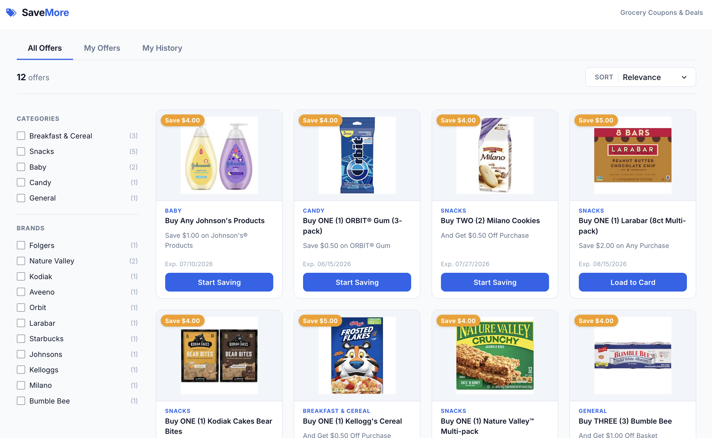

# SaveMore Coupons

A Vue 2 digital coupon clipping app with category filtering, sort, and a simulated loyalty reward progression system. Built as a portfolio project demonstrating real-world frontend patterns: component composition, Vuex state management, reactive routing, and a lightweight design system.



---

## Features

- **Browse offers** — grid of available grocery coupons with product images
- **Filter by category and brand** — sidebar checkboxes narrow the grid in real time
- **Sort** — by most recent, expiration date, value, category, or relevance (logged-in)
- **Search** — autocomplete by brand or category name
- **Clip coupons** — load offers to a loyalty card with loading state and success toast
- **Continuity/challenge progress** — pip-based progress indicator for multi-purchase rewards
- **Authenticated views** — My Offers, My History, Challenge Started, Award Awaiting, Expired, Unredeemed Reward tabs (visible when logged in)
- **Responsive** — sidebar layout on desktop, slide-up filter overlay on mobile
- **Error handling** — fetch error state with retry, clip error dialog

---

## Tech Stack

| Tool | Version | Role |
|---|---|---|
| [Vue 2](https://v2.vuejs.org/) | 2.6 | Component framework |
| [Vuex 3](https://v3.vuex.vuejs.org/) | 3.1 | Global state (user, notifications) |
| [Vue Router 3](https://v3.router.vuejs.org/) | 3.1 | Client-side routing with scope meta |
| [Vuetify 2](https://v2.vuetifyjs.com/) | 2.6 | Material Design UI components + breakpoints |
| [Axios](https://axios-http.com/) | 0.21 | HTTP requests |
| [Lodash](https://lodash.com/) | 4.17 | Sort and collection utilities |

---

## Local Setup

### Prerequisites

- Node.js ≥ 14
- npm ≥ 6

### Install

```bash
git clone https://github.com/Van-Code/vue-coupons-page.git
cd vue-coupons-page
npm install
```

### Run

```bash
npm run serve
```

Open [http://localhost:8080/coupons/dist](http://localhost:8080/coupons/dist) in your browser.

> **Logged-in demo:** The app defaults to a signed-in user with a loyalty card. To simulate a logged-out state, append `?loggedOut=true` to the URL.

---

## Scripts

| Script | Description |
|---|---|
| `npm run serve` | Start dev server with hot reload |
| `npm run build` | Production build to `dist/` |

---

## Project Structure

```
src/
├── assets/
│   ├── images/              # Product images
│   └── styles/
│       └── globals.scss     # Design tokens (CSS custom properties) + base styles
├── constants/
│   └── index.js             # USER_STATES, SCOPES, SORT_OPTIONS named constants
├── entities/
│   ├── coupons.js           # Coupon fetch, merge, and dedup logic
│   └── user.js              # Auth check mixin (reads user fixture on mount)
├── mixins/
│   └── coupons.js           # clip() / unclip() action methods
├── plugins/
│   └── vuetify.js           # Vuetify theme (colors, custom properties)
├── router/
│   └── index.js             # Routes — each carries a meta.scope value
├── store/
│   └── index.js             # Vuex store: user state, notification toast
└── views/
    ├── components/
    │   ├── CouponItem.vue   # Single coupon card (CTA logic, clip action, progress)
    │   ├── CouponList.vue   # CSS Grid wrapper for CouponItem
    │   ├── FiltersList.vue  # Sidebar checkbox group (category or brand)
    │   ├── SortList.vue     # Sort dropdown + brand/category autocomplete search
    │   └── Tabs.vue         # Desktop v-tabs / mobile select navigation
    ├── Coupons.vue          # Page layout, filter/sort state, empty state
    ├── Home.vue             # Route component wrapper
    └── Shell.vue            # App shell + global snackbar
```

---

## Architecture

### Data flow

`App.vue` resolves user state and fetches coupon data on mount, then builds an `options` object that flows down through `Shell → Home → Coupons` and its children:

```
options = {
  coupons: { browse: [...], active: [...], redeemed: [...], ... },
  tabs:    [ { link, name, scope, subtabs }, ... ],
  filters: { browse: { category: [...], brand: [...] }, ... }
}
```

Coupon collections are keyed by **scope** — a string constant that maps both to a route's `meta.scope` and to a key in `options.coupons`. This makes navigating between tabs a simple lookup rather than a re-fetch.

### Scope system

| Constant | Route | Shown to |
|---|---|---|
| `SCOPES.BROWSE` | `/` | All users |
| `SCOPES.ACTIVE` | `/myactive` | Logged in |
| `SCOPES.REDEEMED` | `/myredeemed` | Logged in |
| `SCOPES.CHALLENGES` | `/mychallenges` | Logged in |
| `SCOPES.AWARDS_AWAITING` | `/myawardsawaiting` | Logged in |
| `SCOPES.EXPIRED` | `/myexpired` | Logged in |
| `SCOPES.UNREDEEMED` | `/myunredeemed` | Logged in |

### Authentication

User state is resolved in `entities/user.js` via `userCheck()`, which reads from local JSON fixtures. Three states are defined as named constants:

| Constant | Value | Meaning |
|---|---|---|
| `USER_STATES.LOGGED_OUT` | `0` | Not signed in — shows "Login to Save" CTA |
| `USER_STATES.SIGNED_IN_NO_CARD` | `1` | Signed in, no loyalty card — shows "Add Card to Save" |
| `USER_STATES.SIGNED_IN_WITH_CARD` | `2` | Full access — can clip coupons |

**Demo fixtures:**
- `public/json/user.json` — signed-in user with a card on file
- `public/json/user2.json` — logged-out state (use `?loggedOut=true`)

### Coupon clipping

`CouponItem.vue` calls `clip()` from `src/mixins/coupons.js`, which hits `./json/true.json` to simulate an API success response. On success:

1. The button shows a loading spinner while the request is in flight
2. The CTA updates to a muted "Loaded to Card" / "Savings Started" label
3. The coupon is moved from `options.coupons.browse` to `options.coupons.active`
4. A Vuex `notify` mutation triggers a global success snackbar in `Shell.vue`

### Design system

All visual tokens live in `src/assets/styles/globals.scss` as CSS custom properties (`--color-primary`, `--space-4`, `--shadow-md`, etc.) and are imported globally via `main.js`. Vuetify's theme is configured with `customProperties: true` so theme colors are also available as CSS variables.

---

## Known Limitations

- **No real backend** — all data is served from static JSON files in `public/json/`
- **Clip state is not persisted** — reloading the page resets all clipped coupons
- **`options` is a mutable shared prop** — works at this scale; a larger app would move coupon collections into a Vuex module
- **Vue 2** — EOL as of December 2023; a production upgrade path would target Vue 3 + Composition API

---

## Future Improvements

- Migrate to Vue 3 + `<script setup>` Composition API
- Move coupon and filter state into Vuex modules (replacing the `options` prop chain)
- Real API integration with JWT authentication
- Pagination or virtual scroll for large coupon catalogs
- Unit tests for filter logic, sort, and clip state transitions
- PWA manifest + service worker for offline browsing
